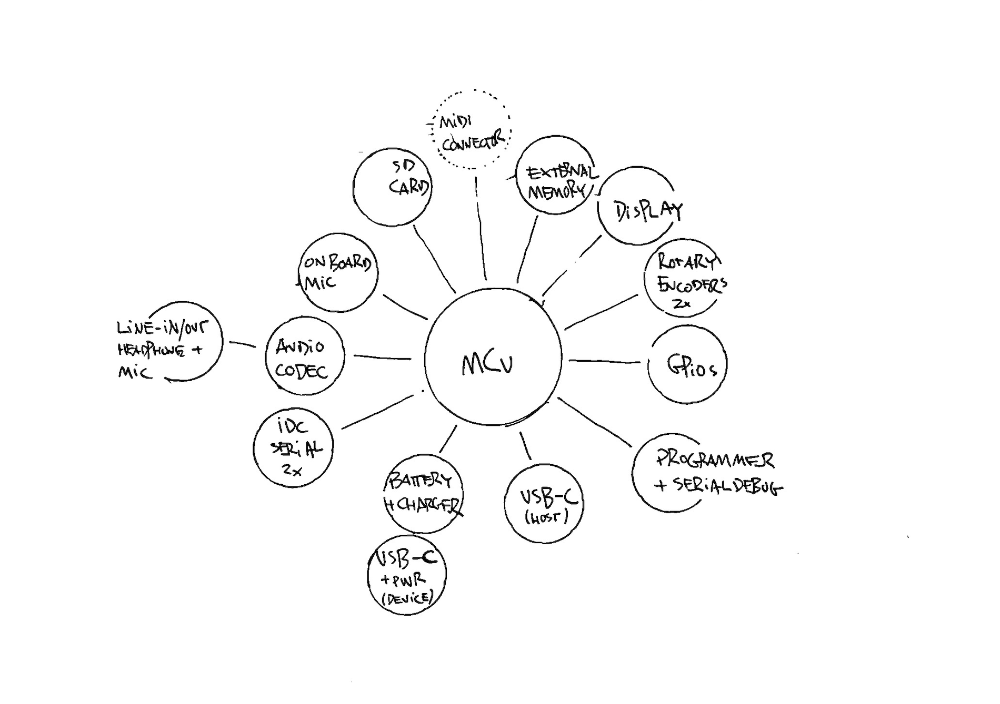
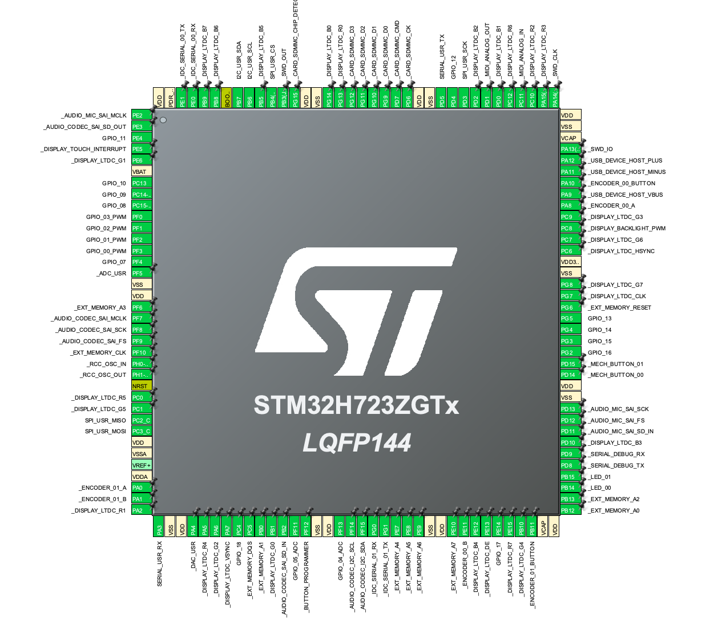

# KLANGSTROM / KLST_PANDA / SYSTEM ARCHITECTURE



- core ( MCU )
- external memory
- audio codec
- display
- on-board microphone
- SD Card
- USB device + host
- battery ( + charging )
- rotary encoder
- GPIO ( port )
- MIDI ( analog )
- DAC + ADC
- IDC serial
- programmer interface
- Dimmable LEDs
- Buttons
- Mechanical Keys

## Core

the core is a `‌STM32H723ZGT` by ST, a 32-bit Arm® Cortex®-M7 CPU ( or MCU ) with 550MHz, 564KB RAM, 1024KB Flash, and FPU that comes in a LQFP-144 ( 20x20x1.4mm ) package.

- [STM32H723ZG](https://www.st.com/resource/en/datasheet/stm32h723zg.pdf) ( datasheet )

## External Memory

external memory is provided by `S70KL1282` by Infineon ( or more specifically `S70KL1282GABHV020` ), a 16MB ( or 128Mb ) DRAM with HYPERBUS™ interface 

- [S70KL1282, S70KS1282: 128 Mb HYPERRAMTM self-refresh DRAM (PSRAM) ( datasheet )](https://www.infineon.com/dgdl/Infineon-S70KL1282_S70KS1282_3.0_V_1.8_V_128_Mb_(16_MB)_HYPERBUS_INTERFACE_HYPERRAM_(SELF-REFRESH_DRAM)-DataSheet-v02_00-EN.pdf?fileId=8ac78c8c7d0d8da4017d0ee9315b7210) 

## Audio Codec

the audio codec is a `‌WM8904` by Cirrus Logic. it features stereo headphone amplifiers in a QFN-32 package. it can be interface via a stereo line-in ( 3.5mm, TRS ), a stereo line-out ( 3.5mm, TRS ) or a 3-ring audio connector ( 3.5mm, TRRS with CTIA allocation ) for stereo headphones and mono microphone.

- [WM8904 ( datasheet )](https://statics.cirrus.com/pubs/proDatasheet/WM8904_Rev4.1.pdf)

## Display

the display is a 4.3" TFT LCD ( `ER-TFT043A2-3` ) with a resolution of 480×272px, 24Bit colors. it is connected via a 40-pin FPC connector and features a capacitive touch surface ( interfaced via an `‌FT5206` I2C-based controller ) and dimmable a backlight ( via `CAT4139‌` + PWM ).

the display is interfaced with the CPU via a parallel LTDC interface.

- [ER-TFT043A2-3 4.3 inch TFT LCD 480x272 Pixels Display Datasheet](https://www.buydisplay.com/download/manual/ER-TFT043A2-3_Datasheet.pdf)
- [FT5206](https://www.buydisplay.com/download/ic/FT5206.pdf)
- [CAT4139TD-GT3](https://www.onsemi.com/download/data-sheet/pdf/cat4139-d.pdf)

## On-Board Microphone

the on-board microphones are two mono MEMS microphone ( `‌MP34DT05TR-A` ) fitted directly onto the board and interfaced via a PDM interface. they can be used in parallel with an external microphone or line-in signals from the audio codec.

## SD Card

the SD Card supports SDIO/SDMMC with a 4-bit wide data line and an automatic card detect functionality.

## USB-C Connectors

the board features two USB-C connectors. one that acts as *USB Device* and takes care of the power supply including the charging of the battery, while the other one can be used as a *USB Host* to connect keyboards, mouse or *USB MIDI Devices*.

## Battery

the battery is a `type 18650` cell fitted into an on-board battery holder, which allows to easily replace the battery. the battery can be charged via the USB-C connector.

the charging mechanism is realized via a `TP5400` an all-in-one battery charger and boost converter IC.

the board also features an on-off switch.

## Rotary Encoder

two rotary encoders `‌PEC11R-4015F-S0024` by Bourns feature a 6mm diameter metal shaft, a metal case, a push button and 24 pulses per 360° rotation but no detents.

the encoder body is 6.5mm high, the shaft is 15mm long of which 5mm feature an M7 thread and the top 7mm are D-shaped.

buttons and pulse channels are debounced in hardware.

## GPIO

a 34-pin port hosts 28 General Purpose Inputs and Outputs (GPIO) and 6 power pins. the GPIO can either be used as standard input or output pins or can have the following extra functionalities:

- 19× GPIO pins including
    - 4× programmable PWM pins
    - 2× ADC pins
    - 1× external interrupt pin
- 1× USART ( 2 pins )
- 1× SPI ( 4 pins )
- 1× I2C ( 2 pins )

the power pins are available as follows:

- 4× GND
- 1× 3.3V
- 1× 5.0V

the GPIO connector is a shrouded IDC connector.

## MIDI analog

an analog MIDI-IN and a MIDI-OUT connector ( both via UART ) are available through two 3.5mm audio connectors ( TRS with `Type A` allocation ).

- [Specification for TRS Adapters Adopted and Released](https://www.midi.org/midi-articles/trs-specification-adopted-and-released)

## DAC + ADC

one Digital-Analog-Converter ( DAC ) and one Analog-Digital-Converter ( ADC ) are available via two 3.5mm audio connectors ( TS ). the DAC can generate voltages from 0.0V–3.3V, while the ADC can measure voltage from 0.0V–3.3V.

## IDC Serial

two serial ports are available as 6-pin shrouded IDC connectors. ports can be connected with a crossed cable ( as also used in KLST_SHEEP ).

the pins of the connectors are assigned as follows:

```
+---------------+
|  GND 1  2 TX  |
 | PWR 3  4 PWR |
|  RX  5  6 GND |
+---------------+
```

## Programmer

the programmer interface features two options. on one side of the board there is a standard STD14 connector ( a SWD connector extended by a dedicated serial port for debugging ), while on the other side there is a PCB-only ( no extra hardware components required ) footprint to be used with a [TC2070-IDC-NL-050](https://www.tag-connect.com/product/tc2070-idc-nl-050) by Tag-Connect.

## Dimmable LEDs

the board features two user-programmable, dimmable ( via PWM ) white LEDs.

note that the board also feature three power LEDs on the backside. two indicate the battery charging states and one the system power.

## Buttons

the board is equipped with a RESET button, a BOOT_MODE button and a PROGRAMMER button. if the BOOT_MODE is pressed at start-up the core (MCU) will enter DFU mode. PROGRAMMER button can trigger DFU mode at runtime. the RESET button triggers a *soft* reset.

## Mechanical Keys

the board features two user-programmable mechanical Cherry MX keys. both can be connected to a hardware interrupt.

## Form Factor

==@TODO==
```
- case+shape
    - switch?
    - portrait mode?
    - something unique!!!
    - hole for a strap
    - black&white PCB
- 4× Mounting Holes
```

## Pin Map



./firmware/KLST_PANDA-STM32H723ZGT-BSP--pin_map.csv

## Timers

==@TODO==

| TIMER | CHANNEL         | DESCRIPTION             |
|-------|-----------------|-------------------------|
| TIM1  | CH1+CH2+CH3     | ENCODER_00(+BUTTON)     |
| TIM2  | CH1+CH2+CH4     | ENCODER_01(+BUTTON)     |
| TIM3  | CH3             | DISPLAY_BACKLIGHT_PWM   |
| TIM4  | CH2             | DISPLAY_TOUCH_INTERRUPT |
| TIM4  | CH3+CH4         | MECH_BUTTON_00*01       |
| TIM12 | CH1+CH2         | LED_00+01               |
| TIM15 | CH1             | GPIO_19_INT             |
| TIM23 | CH1+CH2+CH3+CH4 | GPIO_00+01+02+03_PWM    |
| TIM24 | CH2             | BUTTON_PROGRAMMER       |

## Buses

==@TODO(update)==

### U(S)ART

| U(S)ART | DESCRIPTION        |
|---------|--------------------|
| USART2  | SERIAL_USR         |
| USART3  | SERIAL_DEBUG       |
| UART4   | MIDI_ANALOG_IN+OUT |
| UART9   | IDC_SERIAL_00      |
| UART8   | IDC_SERIAL_01      |

### I2C

| I2C     | DESCRIPTION        |
|---------|--------------------|
| I2C1    | I2C_USR            |
| I2C4    | AUDIO_CODEC_I2C    |
| I2C4    | DISPLAY_TOUCH      |

@NOTE(`‌AUDIO_CODEC_I2C` and `DISPLAY_TOUCH‌` are both interfaced via `‌I2C4`, however, `I2C5` could be an alternative for one of them. `I2C5` pins are currently used for `GPIO_02+03_PWM+GPIO_03_PWM`. )

### SPI

| SPI     | DESCRIPTION        |
|---------|--------------------|
| SPI2    | SPI_USR            |

### ADC+DAC

| ADC/DAC | DESCRIPTION        |
|---------|--------------------|
| ADC1    | GPIO_05_ADC        |
| ADC2    | GPIO_04_ADC        |
| ADC3    | ADC_USR            |
| DAC1    | DAC_USR            |

### SAI

| SAI     | DESCRIPTION        |
|---------|--------------------|
| SAI1    | AUDIO_CODEC        |
| SAI4    | AUDIO_MIC ==@TODO==|
