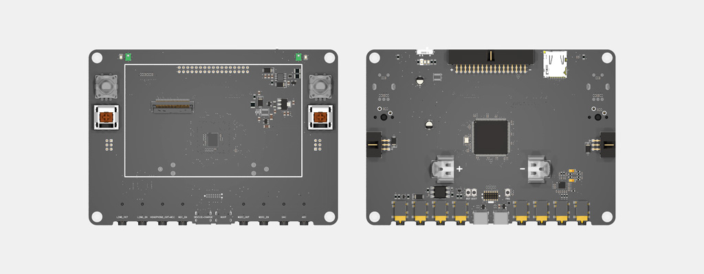
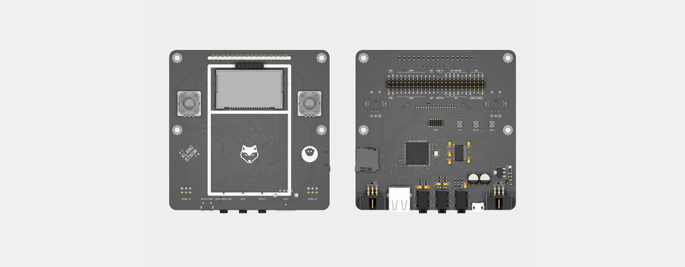
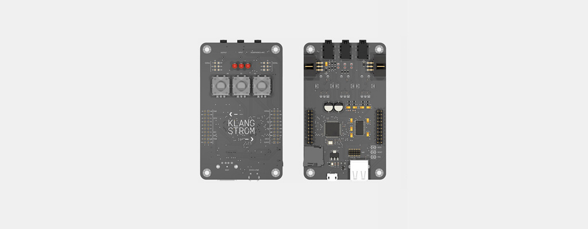

# Klangstrom Hardware 

    

*Klangstrom* (KLST) is a subtractive infrastructure design framework to facilitate generative, networked, embedded sound + music + composition. *klangstrom* is comprised of two software libraries ( *klang* a node+text-based sound synthesis library and *strom* a node+text-based generative composition library ), an embedded hardware platform, and a programming environment to allow seamless development of generative, networked, embedded sound + music + composition applications.

this repository hosts the hardware designs of *Klangstrom* boards:

    
KLST_PANDA (v1.0a) :: handheld-style development board with audio in-+output, MIDI in-+output, 2 on-board microphones, 4.3" TFT display, SD card reader, 16 MB external memory, 2 encoders, 2 mechanical keys, rechargeable battery ( based on STM32H723ZGT )

    
KLST_SHEEP (v0.1) :: handheld-style development board with 16 LEDs, 2 encoders, display ( based on STM32H743VI )

    
KLST_TINY (v0.1) :: pocket-calculator-sized development board with 3 LEDs, 3 encoders ( based on STM32F446RE )

for more information on the project visit [documentations](https://klangstrom-for-arduino.dennisppaul.de) or follow the development process at [Klangstrom Developer Diary](https://klangstrom.dennisppaul.de).
