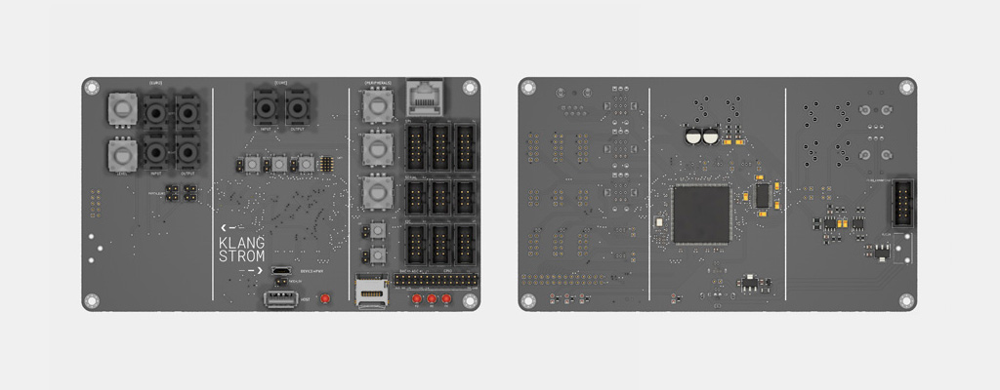

# Klangstrom Hardware 

    
KLST_SHEEP (v0.1) :: handheld-style development board with 16 LEDs, 2 encoders, display ( based on STM32H743VI )

    
KLST_TINY (v0.1) :: pocket-calculator-sized development board with 3 LEDs, 3 encoders ( based on STM32F446RE )

    
KLST_CORE (v0.1) :: chunky development board designed to evaluate features like connectivity to peripherals and eurorack modules ( based on STM32H743II )
